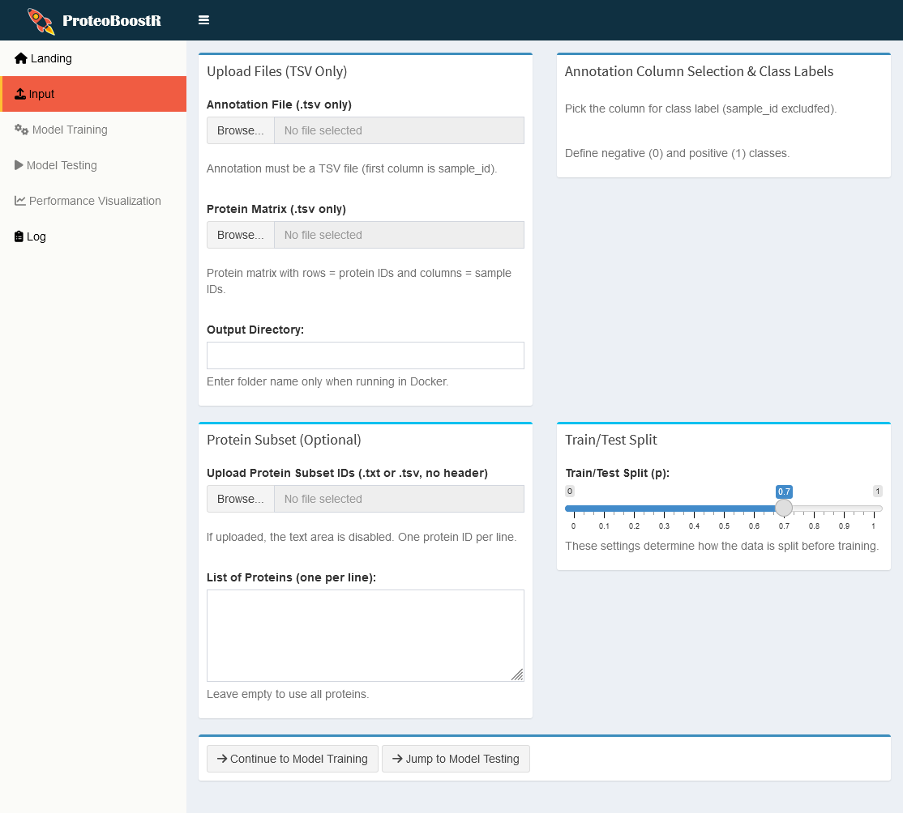

# ProteoBoostR

ProteoBoostR is a Shiny-based tool for supervised classification (e.g. biomarker identification) in proteomics data. It leverages the powerful XGBoost algorithm combined with Bayesian optimization to train and evaluate predictive models. The tool automatically merges proteomics expression data with sample annotations, performs data preprocessing, and outputs key files for further analysis.



## Features

- **Data Preprocessing:**  
  Merges an annotation file (TSV) with a protein expression matrix (TSV) and allows for an optional protein subset filter.
  
- **Model Training:**  
  Performs Bayesian optimization for hyperparameter tuning and trains an XGBoost classifier.
  
- **Model Testing:**  
  Evaluates the model to compute predicted probabilities, evaluation metrics, confusion matrix, and ROC curve.

## Running ProteoBoostR

Using Docker ensures consistent, reproducible results by running ProteoBoostR with official Windows R binaries, which avoids compatibility issues seen with Linux or Conda-based R installations.
This Docker approach prevents discrepancies or failures in AUC calculations caused by differences in compiled R packages.

### Prerequisites
#### Build the Docker Image

1. **Clone the repository:**
   ```bash
   git clone https://github.com/SchillingLabProteomics/ProteoBoostR
   cd ProteoBoostR

2. **Build the Docker image:**
    For Windows 11, you can use the following command:
   ```bash
   docker build -t proteoboostr .
   ```
   For Windows Server >= 2019, you can use the following command:
   ```bash
    docker build --build-arg BASE_IMAGE=mcr.microsoft.com/windows/servercore:ltsc2022 -t proteoboostr .
    ```   

#### Run the Docker Container
Run the container by mapping port 3838:

```bash
docker run proteoboostr -d -p 3838:3838 -v C:\host\path\to\outputs:C:\shinyapp\outputs proteoboostr
```

Replace `C:\host\path\to\outputs` with the full path where you want to save the outputs (locate them in a subdirectory).
Open a browser and navigate to `http://localhost:3838`. Use only a folder name as output directory (which needs to be created in the host machine) when running as a Docker image.


## Workflow Overview

1. **Input Tab**
   - **Upload Files:**  
     - **Annotation File (TSV):** The first column contains sample IDs.
     - **Protein Matrix (TSV):** Rows are protein IDs; columns are sample IDs.
   - **Output Directory:**  
     Enter the full path where output files will be saved.
   - **Annotation Column & Class Labels:**  
     Select the annotation column (excluding sample_id) and define which values represent the negative (0) and positive (1) classes.
   - **Protein Subset (Optional):**  
     Either upload a list of protein IDs (one per line, no header) or type them manually.

2. **Model Training Tab**
   - **Adjust Training Settings:**  
     Set the train/test split.
   - **Bayesian Optimization:**  
     Use default hyperparameter ranges or adjust if needed.
   - **Start Training:**  
     The app merges and preprocesses data, partitions it, tunes hyperparameters, trains the XGBoost model, and automatically saves:
     - The transposed merged (annotated) training matrix (TSV)
     - Best hyperparameters (TSV)
     - The trained model (RDS)

3. **Model Testing Tab**
   - **Model Selection:**  
     Optionally upload a pretrained model (disabled if a model was trained in-session).
   - **Evaluate Model:**  
     When you click "Evaluate on Test Data," the app calculates predictions, evaluation metrics, confusion matrix, and ROC curve.
   - **Outputs Saved Automatically:**  
     - The transposed merged (annotated) testing matrix (TSV)
     - Predicted probabilities (TSV)
     - Evaluation results (TSV)
     - Confusion matrix (TSV)
     - ROC curve (PNG)
     - Application log (LOG)

4. **Performance Visualization & Log Tabs**
   - **Performance Visualization:**  
     View the ROC curve.
   - **Log:**  
     See detailed processing and error messages.

## Quick Start (Defaults)
1. Upload your annotation and protein matrix files.
2. Set the annotation column and class labels.
3. (Optionally) Provide a protein subset.
4. Specify your output directory.
5. Click **"Start Training"** to process data and train the model.
6. Go to **"Model Testing"** to evaluate the model and automatically save all test outputs.
7. Review the ROC curve in **"Performance Visualization"** and check logs in **"Log"**.
