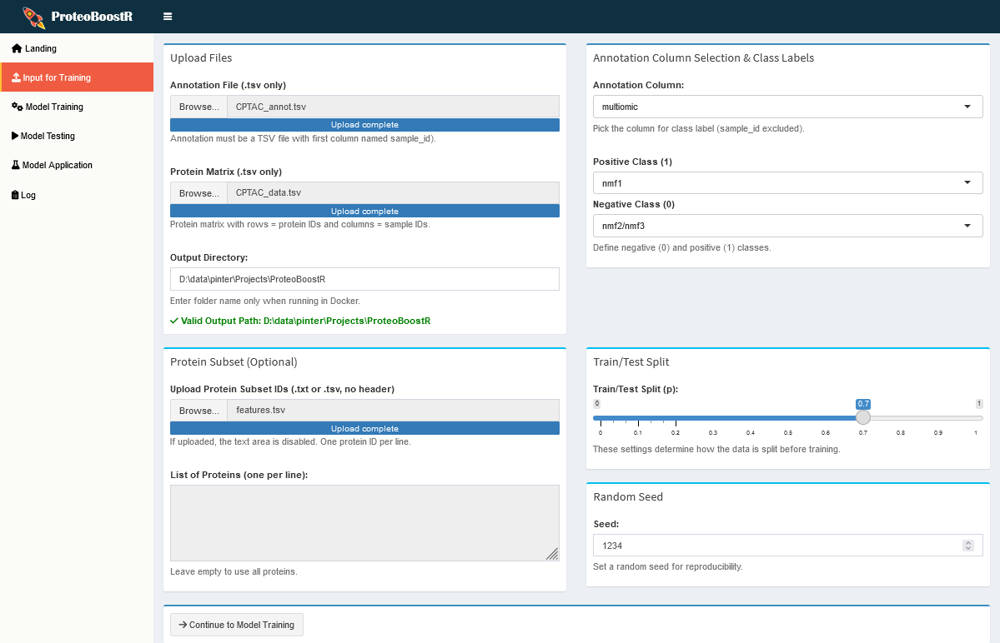

# ProteoBoostR

ProteoBoostR is a Shiny-based tool for supervised classification in proteomics data. It leverages the powerful XGBoost algorithm combined with Bayesian optimization to train and evaluate predictive models. The tool automatically merges proteomics expression data with sample annotations, performs data preprocessing, and outputs key files for further analysis. In addition to training and testing, ProteoBoostR supports applying trained models to independent datasets directly in the UI.



## Features

- **Data Preprocessing:**  
  Merges an annotation file (TSV) with a protein expression matrix (TSV) and allows for an optional protein subset filter.
  
- **Model Training:**  
  Performs Bayesian optimization for hyperparameter tuning and trains an XGBoost classifier.
  
- **Model Testing:**  
  Evaluates the model to compute predicted probabilities, evaluation metrics, confusion matrix, and ROC curve.

- **Model Application:**  
  Apply a trained model to new, independent datasets.  
  - Without labels: outputs prediction scores per sample.  
  - With labels: additionally displays confusion matrix, ROC curve, and evaluation metrics.

## Running ProteoBoostR

Using Docker ensures consistent, reproducible results by running ProteoBoostR with pinned R environments and packages. This approach prevents discrepancies or failures (e.g., in AUC calculations) caused by differences in compiled R packages.

### Prerequisites
#### Build the Docker Image

1. **Clone the repository:**
   ```bash
   git clone https://github.com/SchillingLabProteomics/ProteoBoostR
   cd ProteoBoostR
   ```

2. **Build the Docker image (choose your platform):**
   - Windows (Windows 11 / Server):
     ```bash
     docker build -t proteoboostr .
     ```
     Or for Windows Server >= 2019:
     ```bash
     docker build --build-arg BASE_IMAGE=mcr.microsoft.com/windows/servercore:ltsc2022 -t proteoboostr .
     ```
   - Linux / macOS:
     ```bash
     docker build -f Dockerfile.linux -t proteoboostr-linux .
     ```

#### Run the Docker Container
Run the container by mapping port 3838:

- Windows:
  ```bash
  docker run -d -p 3838:3838 -v C:\host\path\to\outputs:C:\shinyapp\outputs --name proteoboostr proteoboostr
  ```

- Linux / macOS:
  ```bash
  docker run -d -p 3838:3838 -v /absolute/host/path/to/outputs:/app/outputs --name proteoboostr proteoboostr-linux
  ```

Replace the host path with the full path where you want to save outputs.

Open a browser and navigate to `http://localhost:3838`.

Notes:
- When running inside Docker, enter only a folder name (no slashes) as the Output Directory in the UI. The app will write into the mapped `outputs` folder inside the container.
- The app accepts uploads up to 100 MB per file.


## Workflow Overview

1. **Input for Training**
   - **Upload Files:**  
     - **Annotation File (TSV):** The first column contains sample IDs.
     - **Protein Matrix (TSV):** Rows are protein IDs; columns are sample IDs.
   - **Output Directory:**  
     Enter the target path (local runs) or a folder name only (Docker runs).
   - **Annotation Column & Class Labels:**  
     Select the annotation column (excluding sample_id) and define which values represent the negative (0) and positive (1) classes.
   - **Protein Subset (Optional):**  
     Either upload a list of protein IDs (one per line, no header) or type them manually.
   - **Train/Test Split & Seed:**  
     Set the train/test split and the random seed for reproducibility.

2. **Model Training Tab**
   - **Adjust Bayesian Optimization Settings:**  
     General parameters (learning rate, depth, sampling) are visible. Advanced parameter are collapsed by default. Adjust ranges as needed or just use defaults to start with.
   - **Start Training:**  
     The app merges and preprocesses data, partitions it, tunes hyperparameters, trains the XGBoost model, and automatically saves:
     - The transposed merged (annotated) training matrix (TSV)
     - Best hyperparameters (TSV)
     - The trained model (RDS)

3. **Model Testing Tab**
   - **Evaluate Model:**  
     When you click "Evaluate", model performance is evaluated in the testing set and shows the ranked predictions, and displays evaluation metrics, confusion matrix, and ROC curve.
   - **Outputs Saved Automatically:**  
     - The transposed merged (annotated) testing matrix (TSV)
     - Predicted probabilities (TSV)
     - Evaluation results (TSV)
     - Confusion matrix (TSV)
     - ROC curve (PNG)

4. **Model Application Tab**
   - **Upload:**  
     Provide a new protein matrix and optionally an annotation file.
   - **Model & Threshold:**  
     Use the model trained in the session or upload a saved `.rds` model, and provide an evaluation TSV to seed the base threshold.
   - **Outputs & Visualization:**  
     - Without labels: ranked prediction scores and prediction table.  
     - With labels: ranked prediction scores abd prediction table, confusion matrix, ROC curve, and metrics.  
     All outputs are saved in the chosen output directory.

5. **Log Tab**
   - **Log:**  
     See detailed processing messages.

## Training
Find a step-by-step guide to training and testing a model in the [TRAINING.md](training/TRAINING.md).