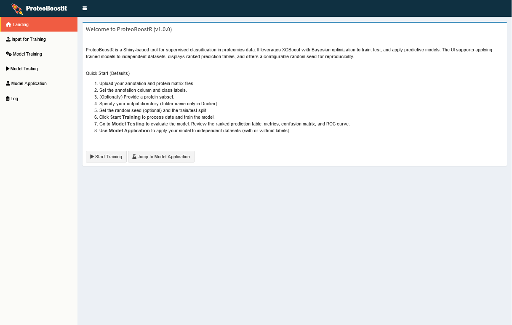
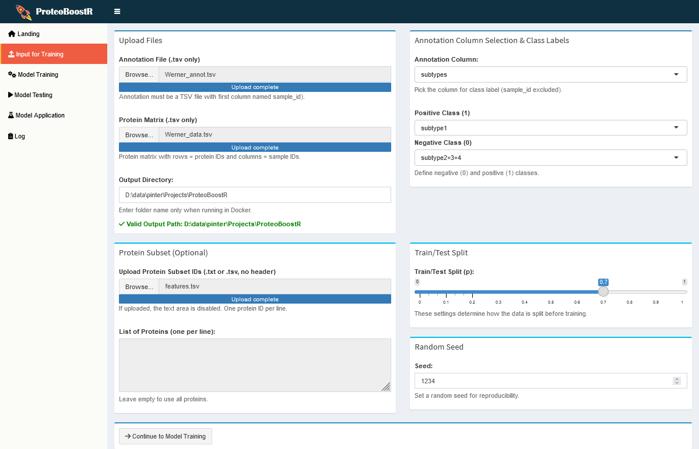
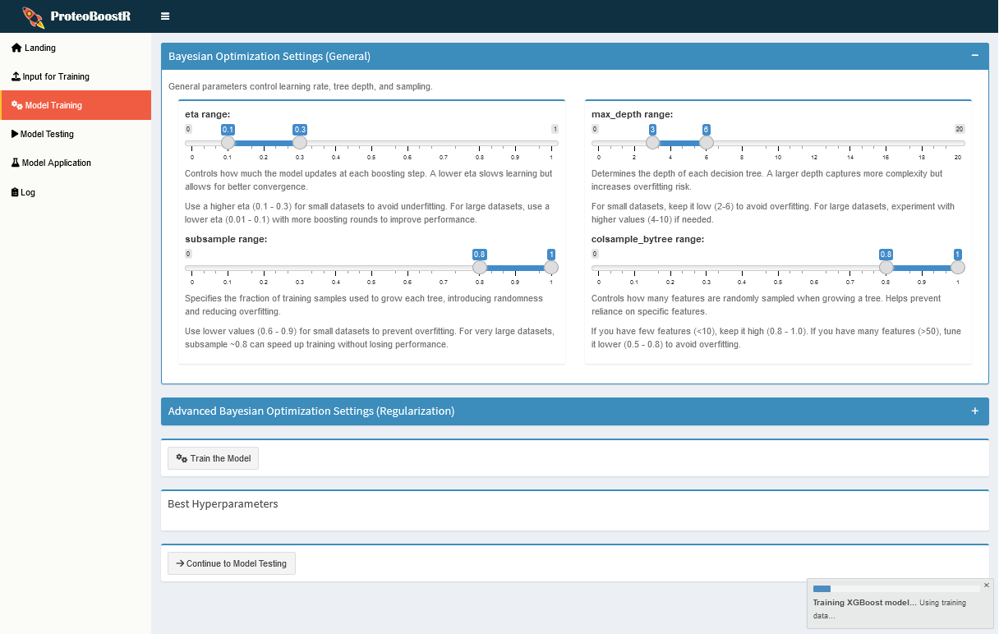
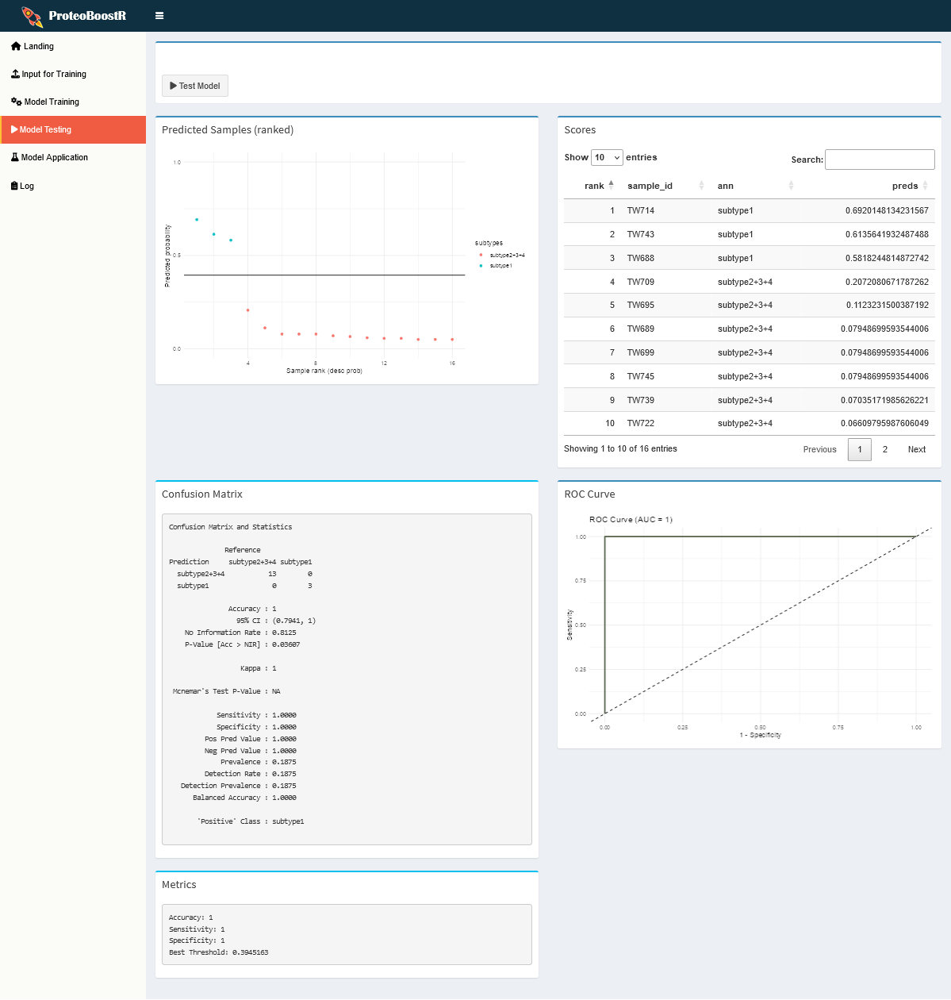
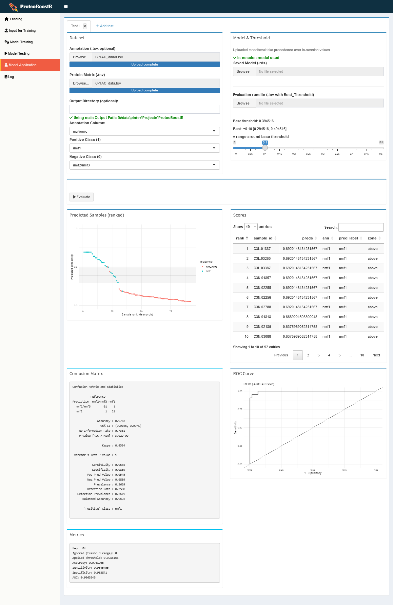

# ProteoBoostR training guide

ProteoBoostR is a Shiny app for supervised classification of proteomics data. It combines XGBoost with Bayesian optimization and provides a guided workflow for training, testing, and applying models directly in the UI. This tutorial walks through the full workflow using the included LUAD example dataset.

> [!NOTE]
> ### What will we build?
> We will train a binary classifier to distinguish cancer vs control samples from a protein abundance matrix, evaluate it on a test set, and apply it to new samples.

# Background

The accompanying paper, "ProteoBoostR: an interactive framework for supervised machine learning in clinical proteomics", describes the motivation and methodology behind ProteoBoostR. This tutorial focuses on the hands on UI workflow and points to the paper for deeper methodological details.

# Requirements and setup

## Prerequisites

1. A running ProteoBoostR instance (Docker recommended)
1. A protein matrix (TSV) and a matching annotation file (TSV)
1. Optional: a protein subset file (one protein ID per line, no header)

If you have not started the app yet, use the Docker instructions in `README.md` and open `http://localhost:3838` in your browser. When running inside Docker, enter only a folder name (no slashes) as the Output Directory in the UI.

## Example data (included)

Use the LUAD example dataset in `LUAD_testcase/`:

1. `LUAD_testcase/TrainingTesting_data.tsv` (protein matrix)
1. `LUAD_testcase/TrainingTesting_annot.tsv` (annotations)
1. `LUAD_testcase/features.tsv` (optional feature list)
1. `LUAD_testcase/Application_data.tsv` (independent application data)
1. `LUAD_testcase/Application_annot.tsv` (optional application labels)

> [!TIP]
> The annotation file must include a `sample_id` column and at least one class label column (for example, `phenotype`). The sample IDs must match the column names in the protein matrix.

# Step 1: Open the app

**Hands on: Confirm the UI layout**
1. Open the app in your browser.
2. Verify the navigation tabs (Input, Model Training, Model Testing, Model Application, Log).
3. Keep this page open for the next steps.

# Step 2: Provide input data

**Hands on: Configure the input tab**
1. Upload `TrainingTesting_annot.tsv` as the annotation file.
2. Upload `TrainingTesting_data.tsv` as the protein matrix.
3. Set Output Directory (a folder name only when using Docker).
4. Choose the annotation column to classify (for example, `phenotype`).
5. Set the negative class (0) and positive class (1) values (for example, `control` and `cancer`).
6. Optional: upload `features.tsv` to limit the model to selected proteins.
7. Set the train/test split (for example, 0.7) and random seed.

> [!NOTE]
> ### Why do sample IDs matter?
> ProteoBoostR merges the annotation and matrix by sample ID. If IDs do not match exactly, the app cannot align the data correctly.

> [!IMPORTANT]
> ### Solution
> Make sure the first column of the annotation file matches the column names in the protein matrix. Watch for hidden spaces or casing differences.

# Step 3: Train the model

**Hands on: Run Bayesian optimization and training**
1. Move to the Model Training tab.
2. Review the optimization ranges (use defaults for a first run).
3. Click **Start Training**.
4. Wait for the training to finish and confirm status messages in the Log tab.

Outputs saved automatically:
- Transposed merged training matrix (TSV)
- Best hyperparameters (TSV)
- Trained model (RDS)

> [!TIP]
> Start with the default parameter ranges. Adjust them if you observe poor performance in the test results.

# Step 4: Test the model

**Hands on: Evaluate performance**
1. Open the Model Testing tab.
2. Click **Evaluate** to run predictions on the held out test set.
3. Review metrics, confusion matrix, and ROC curve.
4. Inspect the ranked prediction table for per sample probabilities.

Outputs saved automatically:

- Transposed merged testing matrix (TSV)
- Predicted probabilities (TSV)
- Evaluation results (TSV)
- Confusion matrix (TSV)
- ROC curve (PNG)

# Interpreting the plots

- **ROC curve:** Plots true positive rate vs false positive rate across thresholds. Curves closer to the top left indicate better discrimination, the diagonal line indicates random performance. The AUC summarizes this in a single value (1.0 = perfect, 0.5 = random).
- **Confusion matrix:** Table of predicted vs true classes. Diagonal cells are correct predictions. From this you can compute accuracy, sensitivity (recall), specificity, and precision.
- **Ranked predictions:** Per sample probabilities for the positive class. The threshold line is the decision cutoff, points close to the threshold are less certain.

# Step 5: Apply the model to new data

**Hands on: Apply to independent samples**
1. Upload `Application_data.tsv` as the protein matrix.
2. Optional: upload `Application_annot.tsv` if labels are available.
3. Use the model trained in this session or upload a saved `.rds` model.
4. Provide the evaluation TSV from the testing step to set the base threshold.
5. Run the application step and review the ranked predictions.

Outputs saved automatically:

- Ranked prediction scores (TSV)
- Prediction table (TSV)
- If labels are provided: confusion matrix, ROC curve, and evaluation metrics

# Troubleshooting

> [!NOTE]
> ### The app shows empty plots or missing results. What should I check?

> [!IMPORTANT]
> ### Solution
> 1. Confirm sample IDs match between annotation and protein matrix.
> 2. Verify you selected the correct annotation column and class labels.
> 3. Check the Log tab for parsing or upload errors.
> 4. Ensure your files are below the 100 MB upload limit.

# Wrap up

You have completed a full ProteoBoostR workflow: data input, Bayesian optimized model training, evaluation on a test set, and application to new samples. You now have saved outputs for downstream analysis and reporting.

## Next steps

- Try a different train/test split or feature subset to compare performance.
- Apply the model to a larger independent cohort.
- Export outputs for integration into downstream statistical workflows.

